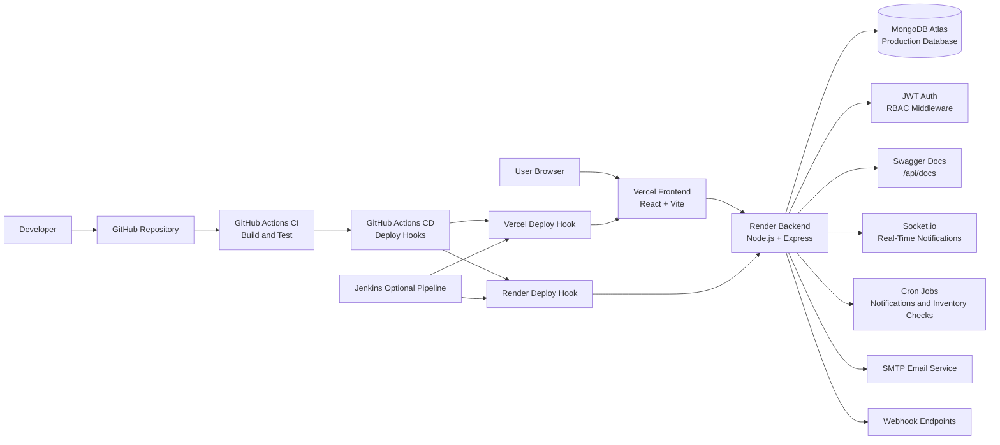
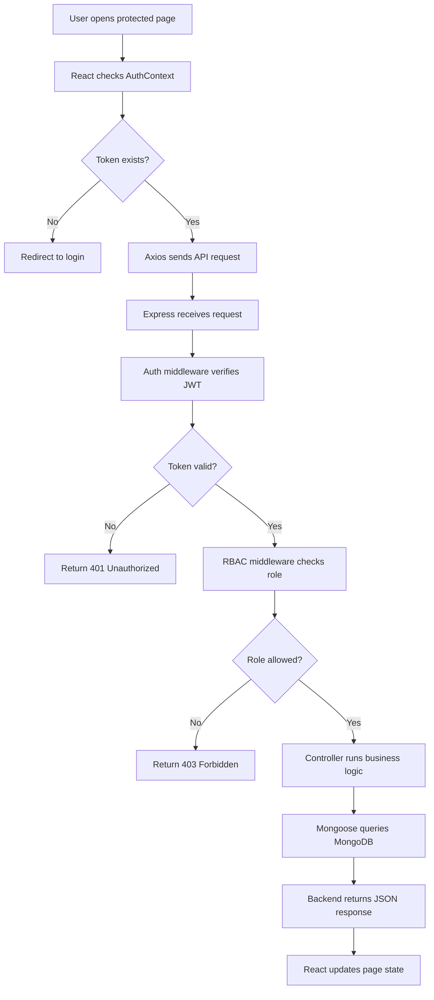
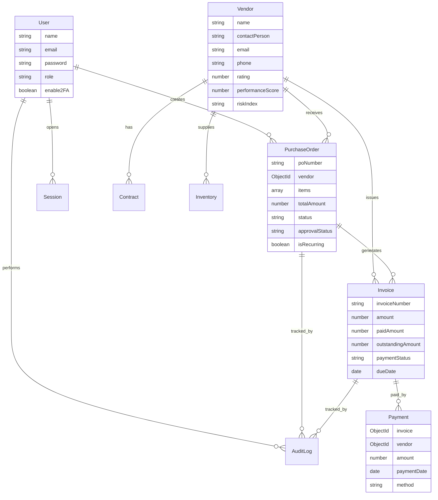

# System Design - Vendor and Purchase Order Manager

This document explains the system architecture, data model, request flow, security design, deployment layout, and CI/CD design for the Vendor and Purchase Order Manager project.

## 1. High Level Architecture

The application has three main runtime parts:

```text
React frontend on Vercel
  sends API requests to
Express backend on Render
  reads and writes data in
MongoDB Atlas
```

The frontend is responsible for user interaction, page routing, forms, charts, tables, and client-side state. The backend is responsible for authentication, authorization, business logic, API responses, scheduled jobs, emails, webhooks, and database access. MongoDB stores all persistent business data.

## 1.1 Application Block Diagram

This block diagram shows how the main parts of the project connect in production.



## 1.2 Request Flow Diagram

This flow shows what happens when a logged-in user opens a protected page and the frontend requests data.



## 2. Main Components

| Component | Responsibility |
| --- | --- |
| React frontend | User interface, routes, forms, dashboards, charts, authenticated page access |
| Express backend | REST APIs, authentication, RBAC, controllers, validation, scheduled jobs |
| MongoDB | Persistent storage for users, vendors, purchase orders, invoices, payments, and other records |
| Socket.io | Real-time notifications between backend and frontend |
| Swagger UI | API documentation at `/api/docs` |
| Render | Hosts the Node.js backend |
| Vercel | Hosts the React frontend |
| MongoDB Atlas | Hosts the production database |
| GitHub Actions | Primary CI/CD automation in the repository |
| Jenkins | Optional enterprise CI/CD pipeline through `Jenkinsfile` |
| Docker | Local container setup and deployability validation |

## 3. Data Model Overview

The system uses Mongoose models in the `server/models` directory.

Important models include:

| Model | Purpose |
| --- | --- |
| User | Stores application users, roles, hashed passwords, 2FA settings, and authentication provider data |
| Vendor | Stores vendor profile, contact details, item prices, rating, performance score, and risk information |
| PurchaseOrder | Stores purchase order number, vendor, line items, amount, status, approval status, and recurring settings |
| Invoice | Stores invoice number, amount, paid amount, outstanding amount, due date, and payment status |
| Payment | Stores payment records linked to invoices and vendors |
| Contract | Stores vendor contract details, dates, value, status, and renewal reminder information |
| Inventory | Stores stock item, SKU, current stock, reorder point, reorder quantity, and preferred vendor |
| Budget | Stores department-level budget limits and usage |
| Notification | Stores user notifications and read status |
| AuditLog | Stores important user actions for accountability |
| Session | Stores active session metadata such as IP address, user agent, and last activity |
| Webhook | Stores webhook endpoint configuration and event subscriptions |
| JournalEntry | Stores finance and accounting journal records |

## 4. Entity Relationships



## 5. Backend Architecture

The backend starts from `server/server.js`.

Main backend responsibilities:

1. Load environment variables.
2. Connect to MongoDB.
3. Create the Express application.
4. Configure CORS.
5. Configure Socket.io.
6. Register middleware.
7. Register API routes.
8. Register Swagger documentation.
9. Start scheduled cron jobs.
10. Start the HTTP server.

Request processing flow:

```text
HTTP request
Middleware
Authentication check, if required
Role check, if required
Route handler
Controller
Mongoose model
MongoDB
JSON response
```

## 6. Frontend Architecture

The frontend starts from `client/src/main.jsx` and renders `App.jsx`.

Main frontend responsibilities:

1. Render login and protected application pages.
2. Store authentication state through AuthContext.
3. Store theme state through ThemeContext.
4. Route users with React Router.
5. Call backend APIs through the Axios API client.
6. Show dashboards, tables, forms, charts, and notifications.

Frontend structure:

```text
main.jsx
AuthProvider
ThemeProvider
App.jsx
React Router
ProtectedRoute
Layout
Page components
```

## 7. Authentication Flow

```text
User enters email and password
Frontend sends POST /api/auth/login
Backend finds user by email
Backend compares password with bcrypt
Backend signs JWT token
Frontend stores token
Frontend sends token in Authorization header
Backend verifies token on protected routes
Backend allows or denies access
```

The token format sent by the frontend is:

```text
Authorization: Bearer <token>
```

## 8. Authorization And RBAC

RBAC means Role-Based Access Control. The backend uses middleware to decide whether a user can access a route.

| Area | Admin | Manager | Accountant | Viewer |
| --- | --- | --- | --- | --- |
| Dashboard | Full | Full | Full | View |
| Vendors | Full | Full | Limited or no write access | View where allowed |
| Purchase Orders | Full | Full | Limited or no write access | View where allowed |
| Invoices | Full | Limited | Full | View where allowed |
| Payments | Full | Limited | Full | View where allowed |
| Budgets | Full | Full | Full | No access |
| Analytics | Full | Full | Full | No access |
| User Management | Full | No access | No access | No access |
| Audit Logs | Full | No access | No access | No access |
| Contracts | Full | Full | Limited or no write access | View where allowed |
| Inventory | Full | Full | Limited or no write access | View where allowed |

The frontend also hides pages that a role should not use, but backend middleware remains the real security layer.

## 9. API Route Groups

| Route Prefix | Purpose |
| --- | --- |
| `/api/auth` | Login, registration, current user |
| `/api/users` | User management |
| `/api/vendors` | Vendor management |
| `/api/purchase-orders` | Purchase order workflow |
| `/api/invoices` | Invoice workflow |
| `/api/payments` | Payment records |
| `/api/dashboard` | Dashboard summary data |
| `/api/analytics` | Reports and analytics |
| `/api/budgets` | Budget management |
| `/api/audit-logs` | Audit log history |
| `/api/notifications` | User notifications |
| `/api/import` | CSV imports |
| `/api/export` | Excel exports |
| `/api/contracts` | Vendor contracts |
| `/api/inventory` | Stock tracking |
| `/api/webhooks` | Webhook configuration |
| `/api/finance` | Finance reports |
| `/api/journal-entries` | Journal entries |
| `/api/accounting` | Accounting records |
| `/api/search` | Search features |

## 10. Business Workflow

Typical procurement workflow:

```text
Vendor is created
Purchase order is created
Purchase order is submitted for approval
Manager or admin approves it
Delivery is tracked
Invoice is created
Payment is recorded
Dashboard and reports update
Audit log records important actions
Notifications are generated when needed
```

## 11. Scheduled Jobs

The backend uses scheduled jobs for recurring background work.

| Job | Schedule | Purpose |
| --- | --- | --- |
| Notification generation | Periodic | Creates alerts for overdue invoices, late deliveries, and other events |
| Inventory reorder checks | Periodic | Checks stock levels and can create reorder-related actions |
| Recurring purchase order checks | Periodic | Supports recurring purchase order workflows |

## 12. Real-Time Notification Design

Socket.io is used for real-time communication.

```text
Frontend opens Socket.io connection
Backend keeps the socket connection active
Backend creates notification event
Backend emits event to connected client
Frontend notification bell updates
```

This avoids forcing the user to refresh the page to see new notifications.

## 13. Deployment Design

Production deployment is split across three managed services:

| Service | Hosts |
| --- | --- |
| Vercel | React frontend |
| Render | Express backend |
| MongoDB Atlas | Database |

Production request flow:

```text
Browser
Vercel frontend
Render backend API
MongoDB Atlas
```

Important environment variables:

| Location | Variable | Purpose |
| --- | --- | --- |
| Vercel | `VITE_API_URL` | Tells frontend where the backend API is |
| Render | `MONGODB_URI` | Connects backend to MongoDB |
| Render | `JWT_SECRET` | Signs and verifies JWT tokens |
| Render | `FRONTEND_URL` | Allows frontend origin for CORS |
| Render | `NODE_ENV` | Runs backend in production mode |
| Render | `ALLOW_PUBLIC_REGISTRATION` | Controls public signup |

## 14. Docker Design

Docker support is included for local container testing and deployment readiness.

`docker-compose.yml` defines:

| Service | Purpose |
| --- | --- |
| mongodb | Local MongoDB database |
| server | Express backend container |
| client | React build served by Nginx |

The server waits for MongoDB to become healthy. The client waits for the server health check. Volumes persist MongoDB data and backend uploads.

## 15. GitHub Actions CI Design

The CI workflow is in `.github/workflows/ci.yml`.

It runs on pushes to `main` and `develop`, and on pull requests targeting `main`.

CI jobs:

| Job | Purpose |
| --- | --- |
| Server Checks | Installs backend dependencies, checks syntax, seeds MongoDB, starts backend, tests health/login/dashboard APIs |
| Client Build | Installs frontend dependencies and builds the Vite application |
| Docker Build Test | Validates Docker Compose and builds backend/frontend Docker images |

CI protects the project from deploying broken code.

## 16. GitHub Actions CD Design

The CD workflow is in `.github/workflows/cd.yml`.

It runs after the CI workflow completes. It deploys only when CI succeeds on the `main` branch.

CD uses these GitHub repository secrets:

```text
RENDER_DEPLOY_HOOK_URL
VERCEL_DEPLOY_HOOK_URL
```

The CD workflow calls these URLs with `curl`. Render and Vercel receive the hook calls and redeploy the backend and frontend.

## 17. Jenkins Design

The optional Jenkins pipeline is in `Jenkinsfile`.

Jenkins stages:

1. Install backend dependencies.
2. Check backend syntax.
3. Install frontend dependencies.
4. Build frontend.
5. Trigger Render and Vercel deploy hooks when running on `main`.
6. Archive frontend build output.

Jenkins credentials needed:

```text
render-deploy-hook-url
vercel-deploy-hook-url
```

If Jenkins becomes the main CI/CD system, GitHub Actions deployment should be disabled to avoid duplicate deployments.

## 18. Scaling Strategy

| Area | Current Design | Future Scale Option |
| --- | --- | --- |
| Database | MongoDB Atlas | Replica sets, indexes, sharding by organization |
| Backend | Render Node service | Multiple instances behind load balancer |
| Frontend | Vercel CDN | Global CDN remains suitable |
| Cache | Node cache | Redis for multiple backend instances |
| WebSockets | Single Socket.io server | Socket.io Redis adapter |
| File storage | Local uploads | S3 or Cloudinary |
| Search | MongoDB queries | Elasticsearch or Atlas Search |
| Email | SMTP or test account | SendGrid, SES, or similar provider |
| Webhooks | Direct HTTP calls | Queue-based delivery with retries |

## 19. Security Strategy

| Concern | Design |
| --- | --- |
| Authentication | JWT tokens and bcrypt password hashing |
| Authorization | Backend role-based middleware |
| Password storage | Hashed passwords, never plain text |
| Rate limiting | Express rate limiter for API and auth routes |
| CORS | Only allowed frontend origins can call the backend |
| Environment secrets | Stored in platform secrets, not code |
| Audit trail | Important create, update, and delete actions are logged |
| Sessions | Session metadata can track IP, user agent, and activity |
| File upload safety | Multer and route-level validation |
| Production registration | Controlled through `ALLOW_PUBLIC_REGISTRATION` |

## 20. Performance Considerations

| Area | Approach |
| --- | --- |
| Database reads | Use indexes and pagination for list endpoints |
| Dashboard | Cache expensive summary data when possible |
| Frontend build | Vite builds optimized static assets |
| API stability | Rate limiting reduces abuse |
| Real-time updates | Socket.io avoids repeated polling |
| Exports | ExcelJS supports report generation |
| Forecasting | Aggregated data keeps calculations small |

## 21. Final Architecture Summary

The project follows a standard production MERN architecture. React handles the user experience, Express owns the business API, MongoDB stores persistent data, and DevOps automation validates and deploys the system. GitHub Actions is the current primary CI/CD path, while Jenkins is available as an alternative pipeline for learning and enterprise-style demonstrations.
